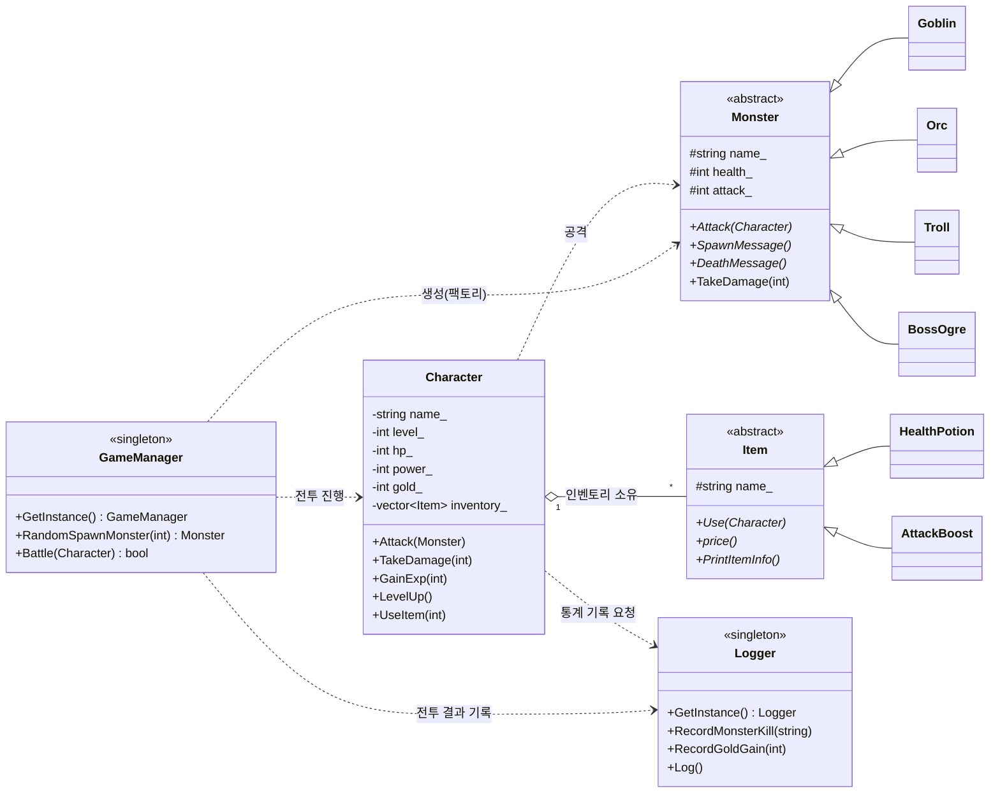
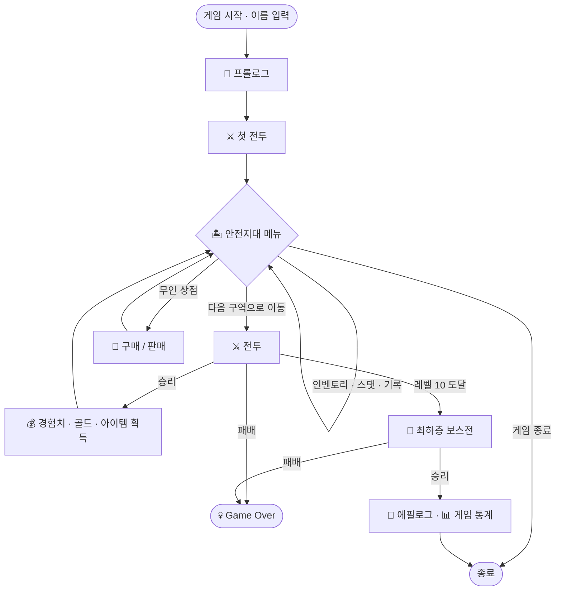

# 🏰 제13 던전 : 초보 모험가의 예정에 없던 단독 공략

> C++로 제작한 콘솔 기반 텍스트 RPG 게임
> "가입즉시 낡은 검 100% 증정! 믿음직한 동료! 안전한 모험!" ...정말 그럴까요?

**사기성 모집 공고에 낚여 던전에 갇힌 초보 모험가가, 최하층 보스를 쓰러뜨리고 '퇴근'하기 위해 홀로 던전을 공략하는 이야기.**

---

<div align="center">

[스토리](#-스토리) • [게임 특징](#-게임-특징) • [조작 방법](#-조작-방법) • [등장 몬스터](#-등장-몬스터) <br>
[아이템](#-아이템) • [파일 구조](#-파일-구조) • [클래스 관계도](#-클래스-관계도) • [게임 진행 흐름](#-게임-진행-흐름) <br>
[빌드 및 실행](#-빌드-및-실행) • [설계 포인트](#-설계-포인트)

</div>

---

## 🎬 스토리

> ```
> ✨♚♚ 제13 던전 초보자 환영 파티 ♚♚✨
> 가입즉시 $$ 신규모험가 ☜☜ 낡은검 100% 증정 ※
> ♜경력무관♜레벨무관♜생존경험무관￥
> 믿음직한동료♬ 안전한모험♬ 화려한보상♬
> 보스만잡으면즉시퇴장가능 ☞☞ 지금바로참가!!!
> ```

오늘 막 모험가 등록을 마친 **당신**은, 의뢰 게시판에 붙은 화려한 모집 공고에 홀려 참가 버튼을 누릅니다.
번쩍이는 문구에 정신이 팔린 나머지, 그 아래 아주 작게 적힌 주의사항은 미처 읽지 못한 채로.

그리고 등록한 지 **10분 만에**, 당신은 보스 토벌 파티의 마지막 자리에 강제로 배정됩니다.
하지만 '환영 파티'라는 이름과 달리, 음산한 던전에서 당신을 기다리고 있던 건
조금도 환영할 생각이 없어 보이는 몬스터들 뿐이었습니다.

정신을 잃었다 깨어났을 때, 함께 싸울 수 있는 동료는 아무도 남아 있지 않았습니다.
그리고 어디선가 들려오는 밝고 경쾌한 안내 방송 —

> *"파티원 전원의 전투 불능을 확인했습니다."*
> *"퇴장을 원하신다면 최하층의 보스를 처치하세요."*
> *"참고로 중도 포기는 불가능합니다."*

살아남기 위해서, 사라진 동료들의 복수를 위해서,
그리고 이 엉망인 던전에서 **퇴근하기 위해서**.

초보 모험가의, 예정에 없던 단독 공략이 지금 시작됩니다.
…과연 당신은 무사히 이 던전에서 **퇴근**할 수 있을까요? 🚪

---

## ✨ 게임 특징

- ⚔️ **턴제 전투** — 매 턴마다 `공격 / 인벤토리 / 스탯 확인 / 도망가기` 중 선택
- 📈 **성장 시스템** — 전투 승리로 경험치를 모아 최대 **레벨 10**까지 성장 (레벨업 시 능력치 상승 + 체력 완전 회복)
- 🎲 **레벨 비례 몬스터** — 플레이어 레벨에 맞춰 몬스터의 체력·공격력이 랜덤하게 스케일링
- 🏝️ **안전지대** — 전투 사이의 거점에서 상점 이용, 인벤토리·스탯·기록 확인
- 🛒 **무인 상점** — 던전에서 번 골드로 아이템을 구매하거나, 필요 없는 아이템을 판매
- 🎒 **아이템 시스템** — 체력 회복 포션, 한 전투 동안 공격력이 오르는 부스트
- 👴 **최하층 보스전** — 레벨 10에 도달하면 등장하는, 도망칠 수 없는 강력한 보스
- 📊 **게임 통계** — 처치한 몬스터, 주고받은 데미지, 아이템·골드 사용 내역을 엔딩에서 정산
- 🎨 **콘솔 연출** — UTF-8 한글/이모지, 콘솔 색상, 페이지 넘김 연출로 몰입감 강화

---

## 🎮 조작 방법

모든 조작은 **숫자 키 입력 + Enter** 로 이루어집니다. (잘못된 입력은 자동으로 걸러집니다.)

**전투 중**

| 입력 | 행동 |
|:---:|:---|
| `1` | 공격 |
| `2` | 인벤토리 (아이템 사용) |
| `3` | 스탯 확인 |
| `4` | 도망가기 (성공 확률 15%, 보스전에서는 불가) |

**안전지대**

| 입력 | 행동 |
|:---:|:---|
| `1` | 다음 구역으로 이동 (전투 시작) |
| `2` | 인벤토리 |
| `3` | 스탯 |
| `4` | 무인 상점 |
| `5` | 기록(통계) 확인 |
| `0` | 게임 종료 |

---

## 👾 등장 몬스터

플레이어의 레벨이 오를수록 더 강한 몬스터가 등장합니다. (체력·공격력은 레벨에 비례해 랜덤 결정)

| 몬스터 | 특징 | 상대적 난이도 |
|:---|:---|:---:|
| 🤢 **악취 고블린** | 지독한 냄새 공격을 퍼붓는 던전의 최약체 | ★☆☆ |
| 🍺 **술취한 오크** | 비틀거리며 술통을 집어 던지는 주정뱅이 | ★★☆ |
| 💪 **헬창 트롤** | "단백질이 더 필요해!" 덤벨을 던지는 근육질 | ★★★ |
| 👴 **???** | 최하층에서 기다리는 도망칠 수 없는 보스 *(레벨 10 도달 시 등장)* | ☠️ |

> 최하층 보스의 정체와 그 무시무시한(?) 필살기는 직접 플레이로 확인해 보세요. 😉

---

## 🎒 아이템

| 아이템 | 효과 | 상점 판매가 |
|:---|:---|:---:|
| ❤️ **HP포션** | 체력을 **50** 회복 | 90 G (기본가 30 G) |
| 🔥 **공격력 부스트** | **해당 전투 동안만** 공격력 +10 (전투 종료 시 원상복구) | 120 G (기본가 40 G) |

- 전투 승리 시 **30% 확률**로 두 아이템 중 하나를 획득합니다.
- 무인 상점에서는 기본가의 3배로 **구매**하고, 기본가 그대로 **판매**할 수 있습니다.

---

## 🗂️ 파일 구조

소스 파일은 하나의 디렉터리에 있지만, 역할에 따라 아래와 같이 구성되어 있습니다.

```
proj/
│
├── main.cpp                     # 프로그램 진입점 · 콘솔 인코딩 설정 · 전체 흐름 orchestration
│
├── 🧍 캐릭터(플레이어)
│   ├── character.h / character.cpp   # Character 클래스 (스탯, 인벤토리, 전투, 골드)
│   └── level_up.cpp                  # Character의 경험치·레벨업 로직 (GainExp / LevelUp)
│
├── 👾 몬스터
│   ├── monster.h / monster.cpp       # Monster 추상 기반 클래스
│   ├── goblin.h  / goblin.cpp        # 악취 고블린
│   ├── orc.h     / orc.cpp           # 술취한 오크
│   ├── troll.h   / troll.cpp         # 헬창 트롤
│   └── bossogre.h / bossogre.cpp     # 최하층 보스 (분노·연속 공격 패턴 보유)
│
├── 🎒 아이템
│   ├── item.h / item.cpp                    # Item 추상 기반 클래스
│   ├── health_potion.h / health_potion.cpp  # 체력 회복 포션
│   └── attack_boost.h  / attack_boost.cpp   # 임시 공격력 증가
│
├── 🕹️ 게임 시스템
│   ├── game_manager.h / game_manager.cpp    # GameManager(싱글톤): 전투 루프 · 몬스터 스폰
│   ├── logger.h / logger.cpp                # Logger(싱글톤): 게임 통계 기록/출력
│   ├── menu.h / menu.cpp                     # 안전지대 메인 메뉴 루프
│   └── shop.h / shop.cpp                     # 무인 상점 (구매/판매)
│
├── 📜 스토리
│   ├── prologue.h / prologue.cpp     # 오프닝 (게임 도입부 연출)
│   └── epilogue.h / epilogue.cpp     # 엔딩 (보스 처치 후 연출)
│
└── 🔧 유틸리티
    ├── random_number_generator.h / .cpp  # 범위 기반 난수 생성
    ├── game_utility.h / .cpp              # 지연(Delay) · 안전지대 이동 · 화면 정리
    ├── input_utils.h / .cpp               # 입력값 유효성 검사
    └── page_utils.h / .cpp                # 스토리 페이지 넘김 연출
```

---

## 🧩 클래스 관계도

핵심은 **두 개의 추상 클래스(`Monster`, `Item`)를 통한 다형성**과, **두 개의 싱글톤(`GameManager`, `Logger`)** 입니다.



**관계 요약**

- **상속(다형성)** : `Goblin` · `Orc` · `Troll` · `BossOgre` → `Monster` / `HealthPotion` · `AttackBoost` → `Item`
  각 자식은 `Attack`, `SpawnMessage`, `Use` 등 가상 함수를 자기만의 개성대로 재정의합니다.
- **소유(Composition)** : `Character`는 `std::vector<std::unique_ptr<Item>>` 로 인벤토리를 **소유**하여 아이템 수명을 안전하게 관리합니다.
- **협력(Dependency)** : `GameManager`가 전투를 진행하며 `Monster`를 생성하고 `Character`와 상호작용합니다.
- **싱글톤** : `GameManager`(전투 총괄)와 `Logger`(통계 기록)는 프로그램 전역에서 단일 인스턴스로 공유됩니다.

---

## 🔄 게임 진행 흐름



---

## 🛠️ 빌드 및 실행

### 요구 사항

- **OS** : Windows (`<windows.h>`, `<conio.h>`, 콘솔 색상/인코딩 API 사용)
- **컴파일러** : C++14 이상 (`std::make_unique`, 람다, `std::function` 사용)
- **콘솔** : UTF-8 지원 터미널 (한글·이모지 출력)

### Visual Studio (권장)

1. 새 **콘솔 앱(C++)** 프로젝트를 생성합니다.
2. 위 `.h` / `.cpp` 파일들을 모두 프로젝트에 추가합니다.
3. `Ctrl + F5` 로 빌드 후 실행합니다.

---

## 🧠 설계 포인트

이 프로젝트는 학습용으로, 여러 객체지향 설계 개념과 패턴을 실습한 결과물입니다.

- **추상 클래스 & 다형성** — `Monster`, `Item`을 순수 가상 함수로 설계하여, 새 몬스터/아이템을 손쉽게 확장할 수 있습니다.
- **팩토리 + 레지스트리 패턴** — `game_manager.cpp`의 `MonsterRegistry()`는 람다 목록으로 몬스터 생성을 관리합니다. 한 줄만 추가하면 새 몬스터가 스폰 풀에 등록됩니다.
  ```cpp
  // 몬스터 추가 시 람다 한 줄만 추가하면 됩니다.
  [](int lv) -> Monster* { return new Dragon(lv); },
  ```
- **싱글톤 패턴** — `GameManager`, `Logger`를 전역 단일 인스턴스로 관리 (복사/대입 연산자 삭제).
- **RAII / 스마트 포인터** — 인벤토리 아이템을 `std::unique_ptr`로 소유해 메모리를 안전하게 관리합니다.
- **관심사 분리** — 입력 검증, 화면 연출, 난수 생성 등 공통 기능을 유틸리티 모듈로 분리했습니다.

<details>
<summary>🥚 <b>숨겨진 요소 (스포일러 주의!)</b></summary>

<br>

- 특정 이름으로 플레이어를 생성하면 발동되는 **개발자 모드**가 숨어 있습니다. (능력치가 폭발적으로 상승!)
- 전투 중 특정 숫자 명령을 입력하면 동작하는 **치트**도 존재합니다. (`999111`, `999222`)
- 그리고... 보스를 처치한 뒤 이어지는 **엔딩의 반전**은, 부디 직접 확인해 보시길. 🎫

</details>

---

<div align="center">

**⚔️ 자, 이제 낡은 검을 고쳐 잡을 시간입니다. 퇴근을 향하여! ⚔️**

</div>
